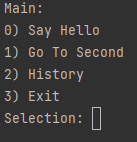
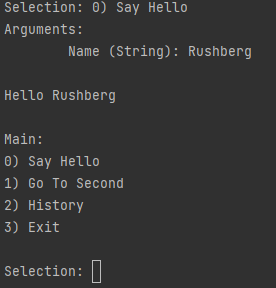
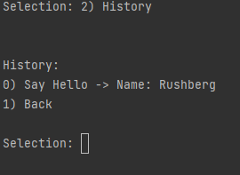

This is an easy to set up and use CLI menu. 

Just give it a function and it will request proper input for each argument and validate it on it's own.

Note that arguments have to be simple types. For functions receiving objects, wrapper is needed.

You can also re-run command from history submenu without re-typing arguments  

See the example below:

    using AutoMenu;
    
    namespace AutoMenu;
    
    public static class App
    {
        public static void Main(string[] args) {
            var mainMenu = new AutoMenu("Main", true);
            var subMenu = new AutoMenu("Second Level");
            mainMenu.AddOption("Go To Second", typeof(AutoMenu).GetMethod(nameof(subMenu.Show)), subMenu);
            mainMenu.AddOption("Say Hello", typeof(App).GetMethod(nameof(SayHello)), null);    
            subMenu.AddOption(null, typeof(App).GetMethod(nameof(LotsOfArgs)), null);            
            mainMenu.Show();
        }
    
        public static string SayHello(string name) {
            return $"Hello {name}";
        }
    
        public static string LotsOfArgs(bool they, string are, int indeed, double validated) {
            return $"They {they} are {are} indeed {indeed} validated {validated}";
        }
    }

